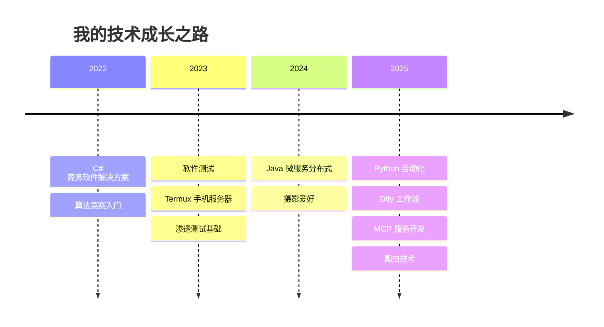

<!-- 动态打字机标题 -->

  

<!-- 渐变分隔线 -->

<!-- 社交链接 - 使用渐变样式 -->

  
  
  
  
  

<!-- 霓虹分隔线 -->

  

<!-- 座右铭 -->

  

<!-- 个人资料展示 - 使用双列布局 -->
<table align="center" width="100%">
  <tr>
    <td width="50%" valign="top">
      <h3 align="center">� 个人档案</h3>
      

         
         
        
      

    </td>
    <td width="50%" valign="top">
      <h3 align="center">📊 数据概览</h3>
      

         
         
        
      

    </td>
  </tr>
</table>

<!-- 技术旅程时间轴 -->
<h2 align="center">🚀 技术进化时间轴</h2>

> 💡 **座右铭**: *嗯... 什么都懂一点，什么都不咋懂的全栈蒟蒻* o(*￣▽￣*)o

<!-- 分隔线 -->

<!-- 技能徽章云 -->
<h2 align="center">
  
  Tech Stack | 技术能力
  
</h2>

  
  <!-- 技能进度条 -->
  <h3>🎯 核心技能掌握度</h3>
  
  
  
  
  
  
  
    
  
  <!-- 技能徽章云 -->
  <h3>☁️ 技能徽章云</h3>
  
  
  
  
  
  
  
  
  
  
  
  
  
  
  
  
  
  
  
  
  
  <!-- 工具图标展示 -->
    
  <h3>🔧 工具链展示</h3>
  
  
  

<!-- 分隔线 -->

<!-- 项目展示 -->
<h2 align="center">
  
  Featured Projects | 精选项目
  
</h2>

  
  <!-- 项目卡片网格 -->
  <table>
    <tr>
      <td width="50%" valign="top">
        
         
        

          <b>💬 琉璃猫 - WebRTC P2P通讯软件</b> 
          
          
           
          自主研发的桌面端即时通讯工具，支持音视频通话、文件传输
        

      </td>
      <td width="50%" valign="top">
        
         
        

          <b>🌐 去哪玩旅游网</b> 
          
          
           
          完整的旅游信息平台，独立完成前后端及服务器部署上线
        

      </td>
    </tr>
    <tr>
      <td width="50%" valign="top">
        
         
        

          <b>📧 美国高中夏令营推广系统</b> 
          
          
           
          实际商业项目，爬取美国学校邮箱进行邮件营销推广
        

      </td>
      <td width="50%" valign="top">
        
         
        

          <b>📊 B站榜单数据分析</b> 
          
          
           
          抓取B站热门榜单数据进行多维度可视化分析
        

      </td>
    </tr>
  </table>
  
  <!-- 更多项目折叠面板 -->
  

    
<b>📂 查看更多项目...</b>

     
    <table>
      <tr>
        <td width="50%" valign="top">
          

            <b>🛒 当当网电商系统</b> 
            
             
            基于C#的B2C电商平台，实现商品管理、购物车、订单系统
          

        </td>
        <td width="50%" valign="top">
          

            <b>🔧 RuoYi资源协同管理系统</b> 
            
             
            企业级资源管理系统，参与权限模块与测试流程设计
          

        </td>
      </tr>
      <tr>
        <td width="50%" valign="top">
          

            <b>🎵 网易云WebUI播放器</b> 
            
             
            第三方网易云音乐播放器，支持搜索、播放、歌词显示
          

        </td>
        <td width="50%" valign="top">
          

            <b>📱 Termux服务器环境</b> 
            
             
            在Android手机上搭建完整Linux服务器环境
          

        </td>
      </tr>
    </table>
  

  

<!-- 分隔线 -->

<!-- 竞赛荣誉 -->
<h2 align="center">
  
  Awards & Honors | 竞赛荣誉
</h2>

  

    
    
    
  

  <table>
    <tr>
      <td width="100%">
        <h3 align="center">🥇 第15届蓝桥杯</h3>
        

          
          
        

      </td>
    </tr>
    <tr>
      <td width="100%">
        <h3 align="center">🥉 第6届码蹄杯</h3>
        

          
          
        

      </td>
    </tr>
    <tr>
      <td width="100%">
        <h3 align="center">🥈 其他竞赛奖项</h3>
        

          
          
          
        

      </td>
    </tr>
  </table>

<!-- 荣誉墙 -->

  <h3>🏛️ 荣誉殿堂</h3>
  

<!-- 分隔线 -->

<!-- 博客与认证 -->
<h2 align="center">
  
  Blog & Certifications | 博客与认证
</h2>

  <table>
    <tr>
      <td align="center" width="50%">
        <h3>📜 技术认证</h3>
        

           
          <code>2025年</code> 
          <i>已通过认证，撰写经验分享文章帮助同学与老师</i>
        

      </td>
      <td align="center" width="50%">
        <h3>🌐 技术博客</h3>
        

           
          
          
        

      </td>
    </tr>
  </table>
  
  <h4>📝 文章主题标签</h4>
  

    
    
    
    
    
    
  

<!-- 分隔线 -->

<!-- GitHub 统计 -->
<h2 align="center">
  
  GitHub Analytics | 数据分析
</h2>

  <table>
    <tr>
      <td width="50%" align="center">
        
      </td>
      <td width="50%" align="center">
        
      </td>
    </tr>
  </table>

<!-- 分隔线 -->

<!-- 贡献图 -->

  <h2>
    
    Contribution Graph | 贡献图
  </h2>
  <picture>
    <source media="(prefers-color-scheme: dark)" srcset="https://raw.githubusercontent.com/lggyx/lggyx/output/github-contribution-grid-snake-dark.svg" />
    <source media="(prefers-color-scheme: light)" srcset="https://raw.githubusercontent.com/lggyx/lggyx/output/github-contribution-grid-snake.svg" />
    
  </picture>

<!-- 霓虹分隔线 -->

  

<!-- 页脚 -->

  

<!-- 底部标语 -->

  

    
    
    
  

  
<i>🌟 Star this repository if you find it helpful! 🌟</i>

